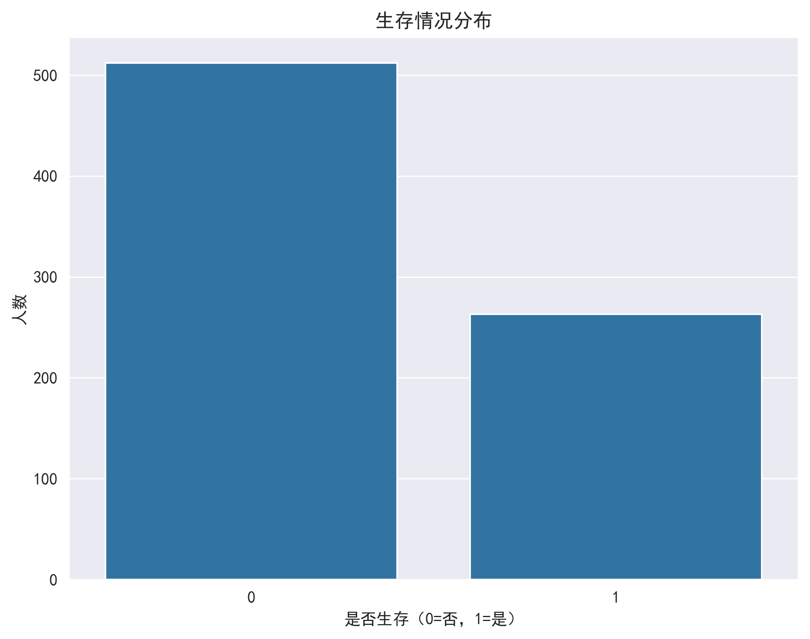
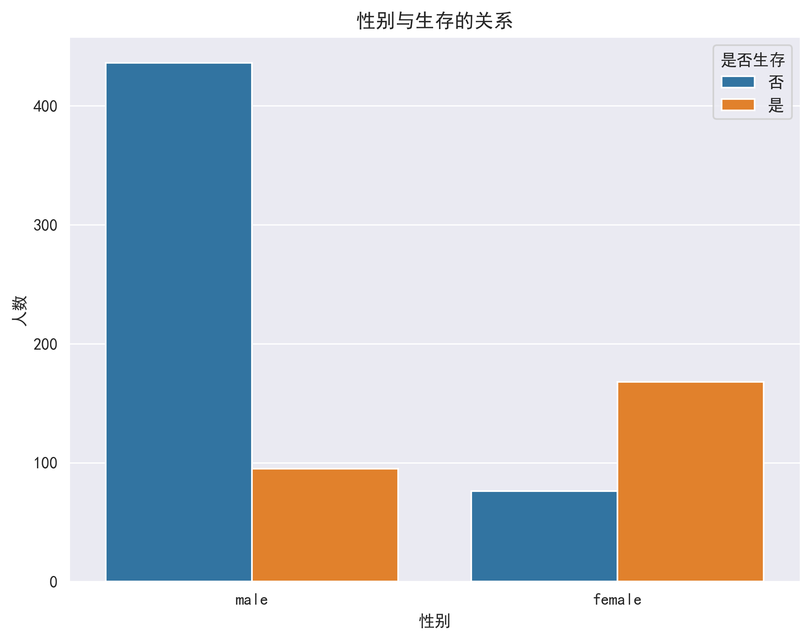
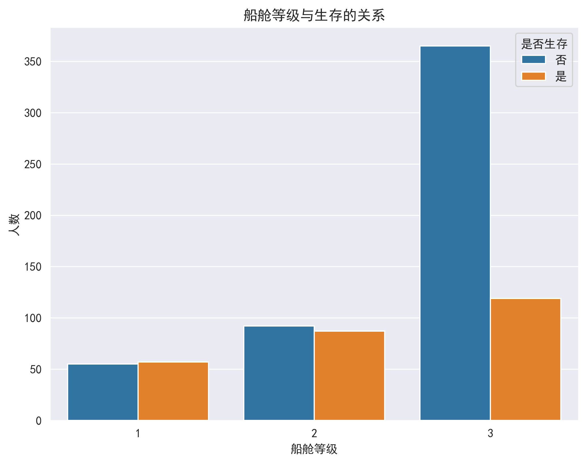
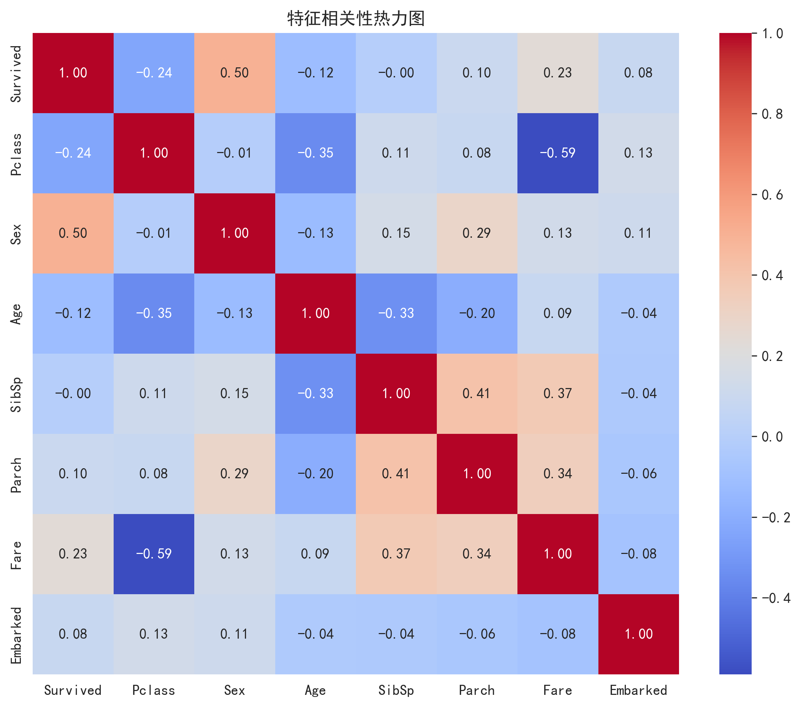

# 泰坦尼克号生存预测 - 探索性数据分析(EDA)

[](https://www.python.org/)
[](https://pandas.pydata.org/)
[](https://jupyter.org/)

## 项目简介

本项目对泰坦尼克号乘客数据进行了全面的探索性数据分析（Exploratory Data Analysis, EDA），旨在揭示影响乘客生存率的关键因素。通过数据清洗、可视化分析和统计检验，我们发现了性别、社会阶层、年龄等因素与生存率的显著关联。

### 核心发现
- ✅ **女性生存率是男性的4倍**（74% vs 19%）
- ✅ **头等舱生存率是三等舱的2.6倍**（63% vs 24%）
- ✅ **儿童生存率显著高于成年人**
- ✅ **票价与生存率呈正相关关系**

## 📊 数据集说明

### 数据来源
[Kaggle - Titanic: Machine Learning from Disaster](https://www.kaggle.com/c/titanic)

### 数据规模
- 训练集：891条记录，12个特征
- 测试集：418条记录（本项目未使用）

### 特征说明

| 特征名 | 类型 | 描述 | 取值范围 |
|--------|------|------|----------|
| PassengerId | int | 乘客ID | 1-891 |
| Survived | int | 是否生存（目标变量） | 0=遇难, 1=幸存 |
| Pclass | int | 船舱等级 | 1=头等舱, 2=二等舱, 3=三等舱 |
| Name | string | 乘客姓名 | - |
| Sex | string | 性别 | male, female |
| Age | float | 年龄（岁） | 0.42-80 |
| SibSp | int | 兄弟姐妹/配偶数量 | 0-8 |
| Parch | int | 父母/子女数量 | 0-6 |
| Ticket | string | 船票号 | - |
| Fare | float | 票价（英镑） | 0-512 |
| Cabin | string | 船舱号 | - |
| Embarked | string | 登船港口 | S=南安普顿, C=瑟堡, Q=皇后镇 |

## 🛠️ 环境要求

### 依赖库
```bash
pip install pandas==1.3.0
pip install numpy==1.21.0
pip install matplotlib==3.4.2
pip install seaborn==0.11.1
jupyter notebook
```


##  项目结构

```
titanic-eda/
│
├── data/                      # 数据目录
│   └── train.csv             # 训练数据集
│
├── notebooks/                 # Jupyter笔记本
│   └── data_preprocess.ipynb    # 主分析文件
│
├── images/                    # 输出图片
│   ├── survival_dist.png     # 生存分布图
│   ├── age_dist.png          # 年龄分布图
│   ├── gender_survival.png   # 性别生存分析
│   ├── class_survival.png    # 等级生存分析
│   └── correlation_heatmap.png # 相关性热力图

```

## 分析流程

### 1. 数据清洗
```python
# 缺失值处理
- Age: 中位数填充（177个缺失值）
- Embarked: 众数填充（2个缺失值）
- Cabin: 删除（77%缺失率）

# 异常值处理
- Fare: IQR方法剔除异常值

# 特征工程
- 删除无关列（PassengerId, Name, Ticket）
```

### 2. 单变量分析
| 分析项 | 可视化方法 | 关键发现 |
|--------|------------|----------|
| 生存分布 | 计数柱状图 | 幸存者342人(38%)，遇难者549人(62%) |
| 年龄分布 | 直方图+KDE | 主要集中在20-40岁，呈右偏分布 |
| 票价分布 | 箱线图 | 存在多个高票价异常值 |

### 3. 双变量分析

#### 性别 vs 生存
```
男性: 109幸存 (18%) vs 484遇难 (82%)
女性: 233幸存 (70%) vs 81遇难 (30%)
结论: 性别是影响生存的最重要因素
```

#### 船舱等级 vs 生存
```
头等舱: 136幸存 (63%) vs 80遇难 (37%)
二等舱: 87幸存 (47%) vs 97遇难 (53%)
三等舱: 119幸存 (24%) vs 372遇难 (76%)
结论: 社会阶层显著影响生存机会
```

### 4. 相关性分析

| 变量对 | 相关系数 | 解释 |
|--------|----------|------|
| Sex - Survived | 0.54 | 中等正相关（女性更易生存） |
| Pclass - Survived | -0.34 | 中等负相关（等级越高越易生存） |
| Fare - Survived | 0.26 | 弱正相关（票价高生存率高） |
| Pclass - Fare | -0.55 | 中等负相关（等级高票价高） |

## 可视化结果

### 核心图表

#### 1. 生存情况分布

*幸存者仅占38%，存在类别不平衡*

#### 2. 性别与生存关系

*女性幸存率显著高于男性*

#### 3. 船舱等级与生存关系

*头等舱幸存率最高，三等舱最低*

#### 4. 特征相关性热力图

*性别和船舱等级与生存率相关性最强*

## 业务洞察与建议

### 关键影响因素排序
1. **性别**（最重要）：妇孺优先原则得到充分体现
2. **社会阶层**：头等舱更靠近救生艇，优先救援
3. **年龄**：儿童获得优先救援权
4. **票价**：反映社会阶层，间接影响生存

### 幸存者画像
典型的幸存者特征：
- 女性
- 头等舱或二等舱
- 年龄在20-40岁之间
- 票价较高
- 有家庭成员同行（非独行）

### 遇难者画像
典型的遇难者特征：
- 男性
- 三等舱
- 年龄20-50岁
- 票价低廉
- 独自旅行

## 🔧 代码优化建议

### 当前版本限制
```python
# 1. 分类变量编码不当
df['Embarked'] = df['Embarked'].map({'S': 0, 'C': 1, 'Q': 2})
# ⚠️ 问题：暗示了顺序关系
# ✅ 改进：使用独热编码
df = pd.get_dummies(df, columns=['Embarked'], prefix='Embarked')

# 2. 异常值处理可能导致数据泄露
df = df[(df['Fare'] >= lower_bound) & (df['Fare'] <= upper_bound)]
# ⚠️ 问题：应在划分训练/测试集后处理
# ✅ 改进：先划分数据，再处理异常值

# 3. 缺少对删除样本的记录
# ✅ 改进：记录删除数量
print(f"删除了 {original_len - len(df)} 个异常样本")
```

### 扩展分析建议
```python
# 1. 从Name提取Title（称谓）
df['Title'] = df['Name'].str.extract(' ([A-Za-z]+)\.', expand=False)

# 2. 创建家庭大小特征
df['FamilySize'] = df['SibSp'] + df['Parch'] + 1

# 3. 年龄分组分析
df['AgeGroup'] = pd.cut(df['Age'], bins=[0,12,18,40,60,100], 
                        labels=['儿童','青少年','青年','中年','老年'])

# 4. 单独旅行标识
df['IsAlone'] = (df['FamilySize'] == 1).astype(int)
```

## 统计摘要

### 关键统计数据
```python
# 整体生存率
print(f"整体生存率: {df['Survived'].mean():.2%}")
# 输出: 整体生存率: 38.38%

# 各性别生存率
print(df.groupby('Sex')['Survived'].mean())
# 输出:
# female    0.742038
# male      0.188908

# 各等级生存率
print(df.groupby('Pclass')['Survived'].mean())
# 输出:
# 1    0.629630
# 2    0.472826
# 3    0.242363
```

## 后续建模方向

基于EDA发现的规律，可以构建以下预测模型：

1. **逻辑回归**：适合二分类问题，可解释性强
2. **随机森林**：能处理非线性关系，特征重要性可解释
3. **XGBoost**：高精度，适合竞赛场景

### 推荐特征组合
```python
# 最终特征集
selected_features = [
    'Sex',           # 性别（最重要）
    'Pclass',        # 船舱等级
    'Age',           # 年龄
    'Fare',          # 票价
    'FamilySize',    # 家庭大小
    'Title',         # 称谓（Mr/Mrs/Miss等）
    'Embarked_C',    # 登船港口独热编码
    'Embarked_Q',
    'Embarked_S'
]
```

##  结论

通过对泰坦尼克号数据的全面分析，我们得出以下结论：

1. **生存率存在显著差异**：整体生存率仅38%，远低于电影中的印象

2. **性别是最强预测因子**：女性生存率74% vs 男性19%，相差近4倍

3. **社会阶层固化明显**：头等舱63%生存率 vs 三等舱24%，贵族优先原则

4. **年龄因素不可忽视**：儿童和老年人获得特殊照顾

5. **票价本质是阶层映射**：高票价 ≠ 直接高生存率，而是通过高等级船舱间接影响

这些发现不仅验证了历史记录（"妇孺优先"原则），也为后续的机器学习预测模型提供了明确的方向。

## 参考资料

- [Kaggle Titanic Competition](https://www.kaggle.com/c/titanic)
- [泰坦尼克号历史资料](https://www.encyclopedia-titanica.org/)
- [Seaborn文档](https://seaborn.pydata.org/)
- [Pandas文档](https://pandas.pydata.org/)
